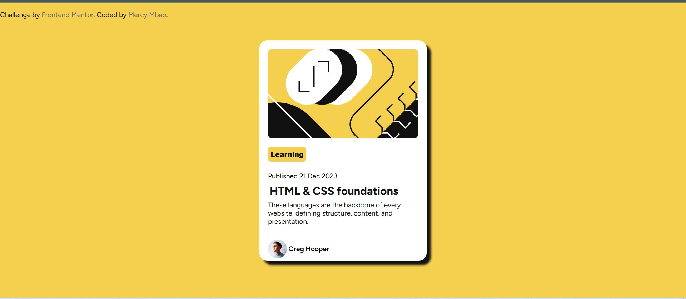

# Frontend Mentor - Blog preview card solution

This is a solution to the [Blog preview card challenge on Frontend Mentor](https://www.frontendmentor.io/challenges/blog-preview-card-ckPaj01IcS). Frontend Mentor challenges help you improve your coding skills by building realistic projects. 

## Table of contents

- [Overview](#overview)
  - [The challenge](#the-challenge)
  - [Screenshot](#screenshot)
  - [Links](#links)
- [My process](#my-process)
  - [Built with](#built-with)
  - [What I learned](#what-i-learned)
  - [Continued development](#continued-development)
  - [Useful resources](#useful-resources)
- [Author](#author)
- [Acknowledgments](#acknowledgments)


## Overview

### The challenge

Users should be able to:

- See hover and focus states for all interactive elements on the page

### Screenshot



A screenshot of your solution. 
Then crop/optimize/edit your image however you like, add it to your project, and update the file path in the image above.


### Links

- Solution URL: [geeks for geeks]()
- Live Site URL: [Add live site URL here](https://your-live-site-url.com)

## My process

### Built with

- Semantic HTML5 markup
- CSS custom properties
- Mobile-first workflow
- [Styled Components](https://styled-components.com/) - For styles


### What I learned

Use this section to recap over some of your major learnings while working through this project. Writing these out and providing code samples of areas you want to highlight is a great way to reinforce your own knowledge.

To see how you can add code snippets, see below:

```html
<button class="btn">Learning</button>
```
```css
.card button:hover {
    background-color: hsl(0, 0%, 7%);
    color: hsl(0, 0%, 100%);
    cursor: pointer;
}
```

If you want more help with writing markdown, we'd recommend checking out [The Markdown Guide](https://www.markdownguide.org/) to learn more.

**Note: Delete this note and the content within this section and replace with your own learnings.**

### Continued development
add animation and button functionality.

**Note: Delete this note and the content within this section and replace with your own plans for continued development.**

### Useful resources

- [geeks for geeks](https://www.geeksforgeeks.org/css-cheat-sheet-a-basic-guide-to-css/?ref=gcse_outind) - This helped me with css cheat sheet


## Author

- Website - [MercyMbao](https://www.your-site.com)
- Frontend Mentor - [@yourusername](https://www.frontendmentor.io/profile/yourusername)

**Note: Delete this note and add/remove/edit lines above based on what links you'd like to share.**

## Acknowledgments

chatgpt and geeks for geeks 

